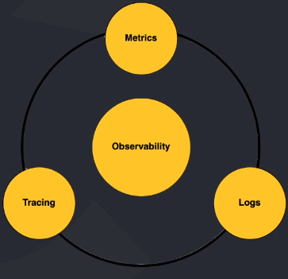
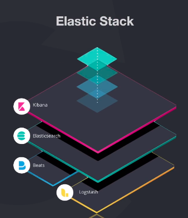
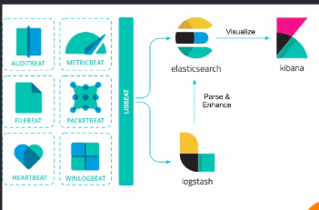

# Observabilidade com Elastic Stack

## Introdução
### 1.1. O que realmente é observabilidade

Na teoria de controle, a observabilidade é definida como uma medida de quão bem os estados internos de um sistema podem 
ser inferidos a partir do conhecimento das saídas externas desse sistema. Simplificando, observabilidade é quão bem você 
pode entender seus sistema complexo (New Relic - Whats Is Observability).

### 1.2. Observabilidade X Monitoramento

* Monitoramento nos mostra que há algo de errado.
* Monitoramento se baseia em saber com antecedência quais sinais você deseja monitorar.
* Observabilidade nos permite perguntar o porquê.

### 1.3. Os 3 pilares da observabilidade

* Métricas: são uma representação numérica de dados medidos em intervalos de tempo.
* Logs: é um registro imutável com carimbo de data/hora de eventos discretos que aconteceram ao longo do tempo.
* Tracing: representação de uma série de eventos distribuídos, causalmente relacionados, que codificam o fluxo de 
requisição de ponta a ponta através de um sistema distribuído (rastreabilidade).

## 2. Elastic Stack
### 2.1. Introdução ao Elastic Stack

#### 2.1.1. Voltando no tempo: ELK Stack

* Elasticsearch: search engine e analytics.
* Logstash: processador de dados através de pipelines que consegue receber, transformar e enviar dados simultaneamente.
* Kibana: permite usuários visualizarem os dados do elasticsearch em diversas perspectivas.

#### 2.1.2. Elasticsearch

* Search engine e analytics.
* Apache Lucene.
* 2010 - Elasticsearch N.V (Elastic).
* Rápido.
* Escalável.
* API Rest.
* Análise e visualização geospacial.
* Application, website e enterprise search.
* Logging e analytics.
* Trabalha de forma distribuída através de shards que possuem redundância de dados.
* Pode escalar milhares de servidores e manipular petabytes de dados.

#### 2.1.3. Logstash

* Engine coletora de dados em tempo real.
* Trabalha com pipelines.
* Recebe dados de múltiplas fontes.
* Normaliza e transforma dados.
* Envia dados para múltiplas fontes.
* Plugins

#### 2.1.4. Kibana

* Ferramenta de visualização e exploração de dados.
* Usada com: logs; análise de séries; monitoramento de aplicações; e inteligência operacional.
* Integrado com elasticsearch.
* Agregadores e filtragem de dados.
* Dashboards.
* Gráficos interativos.
* Mapas.

#### 2.1.5. Beats e Elastic Stack
Qual a diferença entre ELK Stack e Elastic Stack? 

* Beats: foi anunciado em 2015; “lightweight data shipper”; agente coletor de dados; logs, métricas, network data, 
audit data, uptime monitoring; você pode construir seu próprio Beat

#### 2.1.6. Elastic

* Empresa por trás das soluções.
* Cloud Solution.
* Oferecem plugins e recursos licenciados.
* Produtos.
* APM.
* Maps.
* Site Search.
* Enterprise Search.
* App Search.
* Infrastructure.
